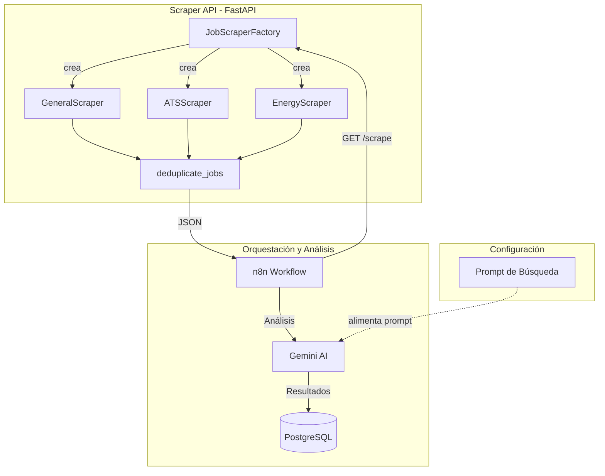

# 🚀 Data Scientist Job Seeker Ecosystem

Este proyecto es tu centro de comando personal para automatizar la búsqueda de empleo orientado a data scientists. Utiliza una arquitectura modular para rastrear vacantes, analizarlas con Inteligencia Artificial (Gemini) y notificarte solo cuando hay un match real con tu perfil.

---

## 🛠️ Tecnologías Utilizadas

- **[n8n](https://n8n.io/)**: Orquestador de flujo de trabajo (Low-code/No-code).
- **[FastAPI](https://fastapi.tiangolo.com/)**: API en Python para el scraping de vacantes.
- **[JobSpy](https://github.com/Bunsly/JobSpy)**: Motor de scraping subyacente para múltiples plataformas.
- **[PostgreSQL](https://www.postgresql.org/)**: Base de datos para persistencia y deduplicación.
- **[Google Gemini AI](https://deepmind.google/technologies/gemini/)**: Filtro inteligente basado en LLM para evaluar afinidad técnica.
- **[Docker](https://www.docker.com/)**: Contenerización de todo el ecosistema.

---

## Modelo Gemini (configuración)

- **Modelo configurado:** `gemini-1.5-flash` (o superior).
- **Plan recomendado:** Se recomienda fuertemente utilizar una **API Key de nivel pago (Pay-as-you-go)**. 
  - *Razón:* Los niveles gratuitos suelen tener límites muy estrictos de transacciones por minuto (TPM). Para un scraping de 20-50 vacantes, el nivel gratuito podría bloquearse por "Rate Limit", mientras que el nivel pago procesa todo en segundos.

## 📂 Estructura del Proyecto

- **`/scraper-api`**: Servicio Python que utiliza `JobSpy` para extraer ofertas de LinkedIn, Indeed y Google Jobs.
- **`/n8n`**: Directorio con la configuración de flujos (`workflow.json`).
- **`/postgres`**: Scripts de inicialización de la base de datos.
- **`/backups`**: Almacenamiento local de instantáneas del sistema.
- **`backup.sh`**: Script automatizado para respaldar workflows y base de datos.

---

## 🏃 Inicio Rápido

1. **Configurar Variables de Entorno**:
   - Copia el archivo de ejemplo y edítalo con tus credenciales:

   ```bash
   cp .env.example .env
   ```

   - Variables importantes (definidas en `.env.example`):
     - `POSTGRES_USER` — usuario de la base de datos (ej: `n8n_user`).
     - `POSTGRES_DB` — nombre de la base de datos (ej: `job_seeker_db`).
     - `DB_PASSWORD` — contraseña que usará Postgres internamente.
     - `GEMINI_API_KEY` — clave de acceso para Gemini (obligatoria si usás el filtro IA).
     - `N8N_ENCRYPTION_KEY` — clave para encriptar datos en n8n.
2. **Levantar el Ecosistema**:

   ```bash
   docker compose up -d --build
   ```

3. **Acceso a Servicios**:
   - **n8n**: [http://localhost:5679](http://localhost:5679) (Importa `n8n/workflow.json` al iniciar).
   - **Scraper API**: [http://localhost:8000/docs](http://localhost:8000/docs).
   - **Base de Datos**: Accesible en `localhost:5434` (mapeado al puerto interno `5432`).

---

## 📧 Configuración de Gmail (Notificaciones)

Para que n8n pueda enviar los reportes por correo, debes configurar las credenciales de Google usando **OAuth2**.

### Pasos rápidos en Google Cloud Console:

1. **Crear Proyecto**: Ve a [Google Cloud Console](https://console.cloud.google.com/) y crea un nuevo proyecto.
2. **Habilitar API**: En "Library", busca y habilita la **Gmail API**.
3. **OAuth Consent Screen**: Configura la pantalla como "External". **Importante**: Agrega tu dirección de email en la sección de "Test Users".
4. **Credenciales**: Crea una credencial de tipo **OAuth Client ID** -> **Web Application**.
5. **Redirect URI**: En n8n, abre el nodo de Gmail, crea una nueva credencial y copia la "OAuth Redirect URL". Pégala en Google Cloud en el campo "Authorized redirect URIs".
6. **Vincular**: Copia el *Client ID* y *Client Secret* de vuelta a n8n y haz clic en "Sign in with Google".

> [!TIP]
> Si tienes problemas, consulta la [Documentación oficial de n8n](https://docs.n8n.io/integrations/builtin/credentials/google/) o busca este [Video Tutorial](https://www.youtube.com/results?search_query=n8n+gmail+oauth2+setup).

---

## ⚙️ Funcionamiento del Ecosistema

El sistema opera en un ciclo de cuatro fases para garantizar calidad y relevancia:

1. **Ingesta**: El orquestador (n8n) consulta la **Scraper API**.
2. **Deduplicación**: Los resultados se cruzan con la base de datos (Postgres) para ignorar vacantes ya procesadas.
3. **Análisis IA**: Gemini evalúa la descripción de cada puesto contra el perfil objetivo (Score 1-5).
4. **Notificación**: Si el Score es >= 4, se genera un reporte visual y se envía por Gmail.

### 🌐 Endpoints de la API

| Endpoint | Descripción | Parámetros clave |
| :--- | :--- | :--- |
| `GET /scrape` | Búsqueda unificada (LinkedIn, Indeed, Google, ATS) | `term`, `location`, `results`, `days_old` |
| `GET /scrape/energy` | Búsqueda especializada en sector energético ARG | `days_old` |

---

## 🤖 Lógica de Filtro (AI Scoring)

El agente de IA utiliza un sistema de scoring del **1 al 5** basado en criterios técnicos:

- **Score 5 (Match Perfecto)**: Coincidencia total en stack (Python/SQL) y seniority Ssr.
- **Score 4 (Buen Match)**: Gap técnico menor o requerimiento de inglés manejable.
- **Score 1 (Descarte)**: Roles de Management (Lead/Staff/Manager), stack incompatible (.NET/Java) o requerimiento de +5 años de experiencia.

---

## 🗄️ Gestión de la Base de Datos

Puedes ejecutar estos comandos directamente desde tu terminal para interactuar con los datos:

### Ver mejores matches (Score >= 5)

```bash
docker exec -it job_seeker-db-1 psql -U n8n_user -d job_seeker_db -c "SELECT title, company, ai_score FROM jobs WHERE ai_score >= 5 ORDER BY ai_score DESC;"
```

### Estadísticas rápidas

```bash
docker exec -it job_seeker-db-1 psql -U n8n_user -d job_seeker_db -c "SELECT processed, COUNT(*) FROM jobs GROUP BY processed;"
```

### Limpiar la base de datos (Reset total)

```bash
docker exec -it job_seeker-db-1 psql -U n8n_user -d job_seeker_db -c "TRUNCATE TABLE jobs RESTART IDENTITY;"
```

---

## 💾 Backups y Seguridad

El proyecto incluye un script robusto para no perder tus avances.

### Realizar un backup manual

```bash
./backup.sh
```

Esto creará una carpeta en `/backups` con:

- El dump completo de la DB (`database.sql`).
- Tus workflows de n8n exportados (individuales y maestros).
- Una copia de tu `.env` y configuración de Docker.

> [!TIP]
> Puedes programar un CRON en tu sistema para ejecutar `./backup.sh` diariamente.

---

- **Resiliencia**: El workflow de n8n incluye un nodo de "Recuperar pendientes" que permite re-procesar vacantes que fallaron o quedaron a mitad de camino sin duplicar datos.
- **Deduplicación**: El sistema utiliza una combinación de Título, Empresa y URL como clave única para evitar procesar la misma oferta dos veces.
- **Filtro de IA**: El prompt de Gemini está diseñado para ser estricto (priorizando Ssr, Dagster y evitando perfiles Senior/Lead).
- **Puertos**: Se utiliza el puerto `5679` para n8n y `5434` para Postgres para evitar conflictos con instalaciones estándar.

---
¡Mucha suerte con el despliegue! Si tenés dudas, consultame. 🦾

## 🧭 Patrones de diseño usados (POO simple)

Para mantener el código claro y abierto a cambios, la implementación del servicio de
scraping (`/scraper-api`) usa una combinación de **Strategy** + **Factory**.

- Strategy: cada tipo de scraping (general, ATS, energía) implementa la misma interfaz
   (`scrape(...)`). Esto permite intercambiar implementaciones sin cambiar el orquestador.
- Factory: una fábrica simple (`JobScraperFactory`) crea instancias concretas según
   el tipo (`'general'`, `'ats'`, `'energy'`).

Diagrama de Arquitectura (Mermaid):



Ventajas rápidas:

- Single Responsibility: cada scraper hace una cosa.
- Open/Closed: agregás un nuevo scraper y la fábrica lo expone sin tocar el orquestador.
- Fácil de testear: cada estrategia se puede mockear/ejecutar aislada.

Si más adelante querés validación de inputs y documentación, se puede agregar `Pydantic`
con modelos `ScrapeRequest` y `ScrapeResponse`.

## 🧪 Tests unitarios (breve)

Hay tests mínimos bajo `scraper-api/tests/` que verifican las piezas críticas:

- `test_general_scraper_returns_results`: mockea `jobspy.scrape_jobs` y valida que
   `GeneralScraper.scrape()` normalice el DataFrame a una lista de diccionarios.
- `test_ats_scraper_multiple_patterns`: asegura que `ATSScraper` itera sobre los
   patrones ATS y devuelve resultados por cada patrón.
- `test_deduplicate_jobs`: comprueba que la función de deduplicación elimina entradas
   con la misma `job_url`.

Cómo ejecutar (recomendado local con virtualenv):

```bash
python3 -m venv .venv
. .venv/bin/activate
python -m pip install --upgrade pip
python -m pip install -r scraper-api/requirements.txt
python -m pip install pytest
pytest -q
```

O dentro del contenedor (recomendado para reproducibilidad):

```bash
docker compose exec scraper pytest -q
# o si preferís un contenedor efímero
docker compose run --rm scraper pytest -q
```

Los tests son intencionalmente ligeros y usan `monkeypatch` para evitar llamadas reales
de red; están pensados como base para ampliar la cobertura más adelante.
